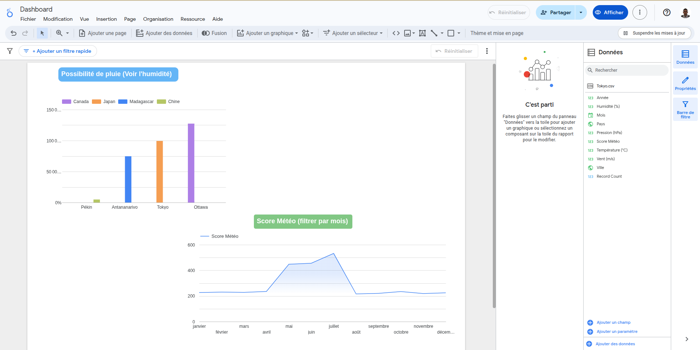

# 🌍 WHEN TO TRAVEL ✈️

Ce projet a pour but d’identifier les **meilleurs mois pour voyager dans le monde** en se basant sur des données météorologiques historiques et récentes.  
Il s’appuie sur un pipeline de traitement de données orchestré avec **Apache Airflow** et présente les résultats dans un **dashboard interactif via Looker Studio**.

---

## 🧠 Fonctionnalités

- 📥 **Extraction** des données météo (historiques et récentes)
- 🧹 **Nettoyage** et **transformation** des données
- 📊 **Analyse exploratoire** (EDA)
- 🎯 **Classement des meilleurs mois** pour voyager
- 📈 **Dashboard Looker Studio** pour visualisation

---

## 🗂️ Structure du projet

```

when-to-travel-Jo/
├── Airflow/                # DAGs et scripts pour Airflow
│   ├── dags/               # Fichiers DAG (ex: weather\_etl\_dag.py)
│   └── scripts/            # Scripts Python (extract, transform…)
│
├── data/                   # Données météorologiques
│   ├── historical/
│   │   ├── raw/            # Données brutes
│   │   └── cleaned/        # Données nettoyées
│   └── recent/             # Données récentes
│
├── EDA/                    # Analyse exploratoire (notebook Jupyter)
│   └── eda.ipynb
│
├── dashboard/              # Capture du dashboard Looker Studio
│   └── dashboard.png
│
├── doc/                    # Documentation complémentaire
│
├── airflow\_venv/           # Environnement virtuel pour Airflow
├── .python-version         # Version Python utilisée
└── README.md               # Ce fichier

````

---

## ⚙️ Installation

### 1. Cloner le projet

```bash
git clone https://github.com/Johnathon47/when-to-travel-Jo.git
cd when-to-travel-Jo
````

### 2. Créer un environnement virtuel

```bash
python -m venv airflow_venv
source airflow_venv/bin/activate
```

### 3. Installer les dépendances

```bash
pip install -r requirements.txt
```

> Assure-toi d’avoir Python 3.10+ installé.
> Les packages clés sont : `apache-airflow`, `pandas`, `gspread`, `oauth2client`

---

## 🚀 Lancer Airflow

### Initialisation de la base de données

```bash
airflow db init
```

### Démarrage des services

```bash
airflow scheduler
airflow webserver
```

Accéder à l'interface : [http://localhost:8080](http://localhost:8080)

---

## 🛠️ DAGs disponibles

| DAG ID            | Description                                          |
| ----------------- | ---------------------------------------------------- |
| `weather_etl_dag` | Pipeline complet d'extraction et de traitement météo |

Ce DAG contient les tâches suivantes :

* `extract_historical` : Extraction des données météo historiques
* `extract_recent` : Extraction des données récentes
* `transform` : Nettoyage, enrichissement, fusion des datasets

---

## 📊 Dashboard Looker Studio

Un dashboard interactif encore en cours.

### 📷 Aperçu :



---

## 📎 Ressources complémentaires

* Notebook EDA : `EDA/eda.ipynb`
* Données transformées : `data/historical/cleaned/`
* Scripts Python : `Airflow/scripts/`

---
